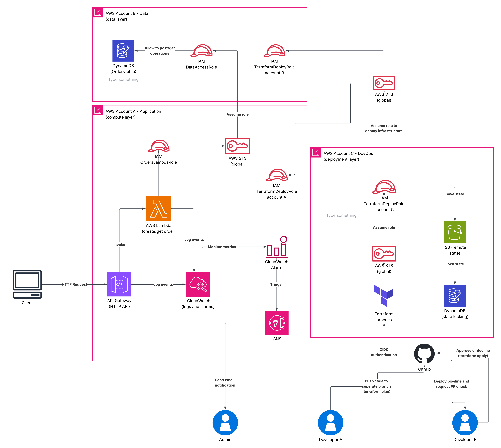

# Serverless Orders — Multi-Account AWS Architecture


A production-oriented serverless order management API built on a multi-account AWS architecture — demonstrating cross-account access via STS AssumeRole, Lambda, API Gateway, DynamoDB, and Infrastructure as Code with Terraform.

## Table of Contents

- [Project Overview](#project-overview)
- [Architecture](#architecture)
- [Prerequisites](#prerequisites)
- [Project Structure](#project-structure)
- [API Reference](#api-reference)
- [Technical Documentation](#technical-documentation)
- [Future Improvements](#future-improvements)
- [Key Takeaways](#key-takeaways)

---

## Project Overview

This project implements a serverless order management API across three isolated
AWS accounts — separating compute, data, and deployment into independent
environments with no shared credentials between them.  

The architecture reflects patterns used in regulated or security-focused
production environments where blast radius reduction and auditability are critical.
Every cross-account interaction uses temporary STS credentials, the CI/CD
pipeline authenticates via OIDC without storing any AWS secrets, and the
entire infrastructure is reproducible from a single `terraform apply`.  

The system evolves across five sprints — from a manually validated proof of
concept to a fully automated, observable platform — documenting real failures
and design decisions at each stage.

**What this project covers:**

- serverless API with API Gateway and Lambda
- multi-account architecture with strict layer separation
- cross-account data access via STS AssumeRole
- Infrastructure as Code with Terraform and multi-account provider configuration
- centralized deployment from a dedicated DevOps account
- CI/CD pipeline with GitHub Actions
- observability with CloudWatch Logs, metrics, and alerting

---

## Architecture

The system separates responsibilities across three AWS accounts:

| Account | Role | Resources |
|---|---|---|
| Account A — Application | Compute layer | API Gateway, Lambda |
| Account B — Data | Data layer | DynamoDB |
| Account C — DevOps | Deployment | Terraform, CI/CD |



Terraform is executed from Account C and deploys into Accounts A and B using AssumeRole — no credentials are shared directly between accounts.

> Full architecture details, IAM role design, and per-sprint implementation
> decisions are documented in the [Technical Documentation](#technical-documentation) below.

---

## Prerequisites

Before deploying this infrastructure, ensure you have the following:

- [Terraform](https://developer.hashicorp.com/terraform/install) `>= 1.5.0`
- Three AWS accounts (Application, Data, DevOps) with appropriate permissions
- AWS CLI configured with a profile for the DevOps account (`tools-local`)
- `TerraformDeployRole` created in Account A and Account B, trusted by Account C

---

## Project Structure
```text
serverless-orders-project
│
├── terraform/                 # Infrastructure as Code
│   ├── modules/
│   │   ├── api/               # API Gateway configuration
│   │   ├── lambda/            # Lambda functions and IAM
│   │   └── dynamodb/          # DynamoDB table and access roles
│   ├── main.tf
│   ├── providers.tf
│   ├── variables.tf
│   └── outputs.tf
├── lambda/
│   ├── create_order/          # POST /orders handler
│   └── get_order/             # GET /orders/{id} handler
├── docs/
│   └── sprints/
│       ├── sprint-01-manual-setup.md
│       ├── sprint-02-terraform.md
│       ├── sprint-03-remote-state.md
│       ├── sprint-04-cicd.md
│       └── sprint-05-monitoring.md
└── README.md
```

---

## API Reference

### Create order
```bash
curl -X POST "https://<api-url>/orders" \
  -H "Content-Type: application/json" \
  -d '{"customerId": "test123", "totalAmount": 100}'
```

### Get order
```bash
curl "https://<api-url>/orders/<orderId>"
```

---

## Technical Documentation

The full technical documentation is split across five sprint docs — each covering
the design decisions and implementation changes introduced at that stage.
If you want to understand how and why the system was built, start there.

| Sprint | Focus | Key additions |
|---|---|---|
| [Sprint 01](docs/sprints/sprint-01-manual-setup.md) | Manual setup | Architecture validation without IaC |
| [Sprint 02](docs/sprints/sprint-02-terraform-automation.md) | Terraform | Multi-account IaC, provider AssumeRole |
| [Sprint 03](docs/sprints/sprint-03-terraform-backend-modularization.md) | State management | Remote state, locking, modularization |
| [Sprint 04](docs/sprints/sprint-04-sprint-04-ci-cd-github-actions-oidc.md) | CI/CD | Automated deployments via GitHub Actions |
| [Sprint 05](docs/sprints/sprint-05-observability-alerting.md) | Observability | CloudWatch Logs, metrics, alerting |

---

## Future Improvements

- Frontend layer (S3 + CloudFront)
- Multi-environment support (dev / staging / prod)
- Fine-grained least-privilege IAM policies
- Authentication layer (Cognito / JWT)
- Distributed tracing (X-Ray)

---

## Key Takeaways

- Multi-account architecture enforces strict separation between compute, data, and deployment layers
- STS AssumeRole eliminates static credentials — all cross-account access is temporary and role-based
- Serverless architecture removes infrastructure management overhead while maintaining scalability
- Deploying Terraform from a dedicated DevOps account centralizes access control and audit trails
- Building manually first, then automating, surfaces dependencies and IAM behavior that IaC alone would hide
- Incremental sprint-based development keeps the system in a working, testable state at every stage

---

[⬆ Back to top](#serverless-orders--multi-account-aws-architecture)