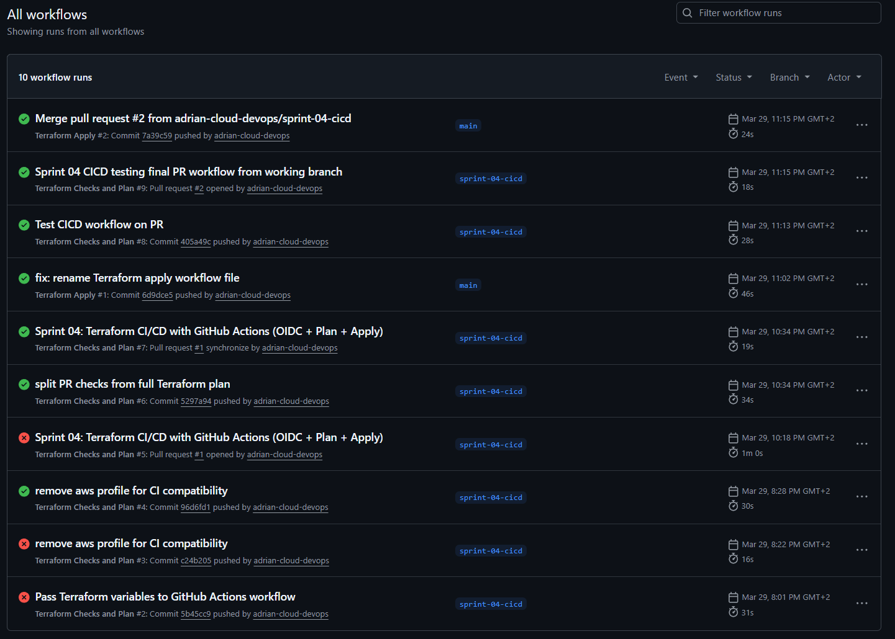
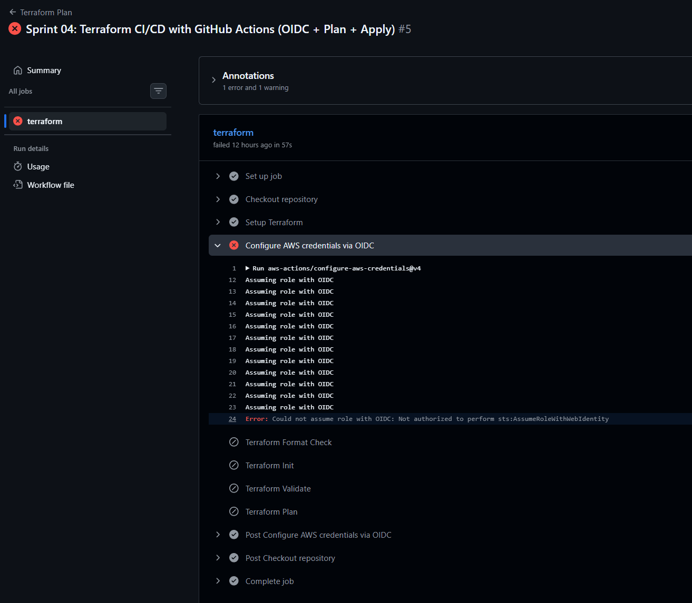
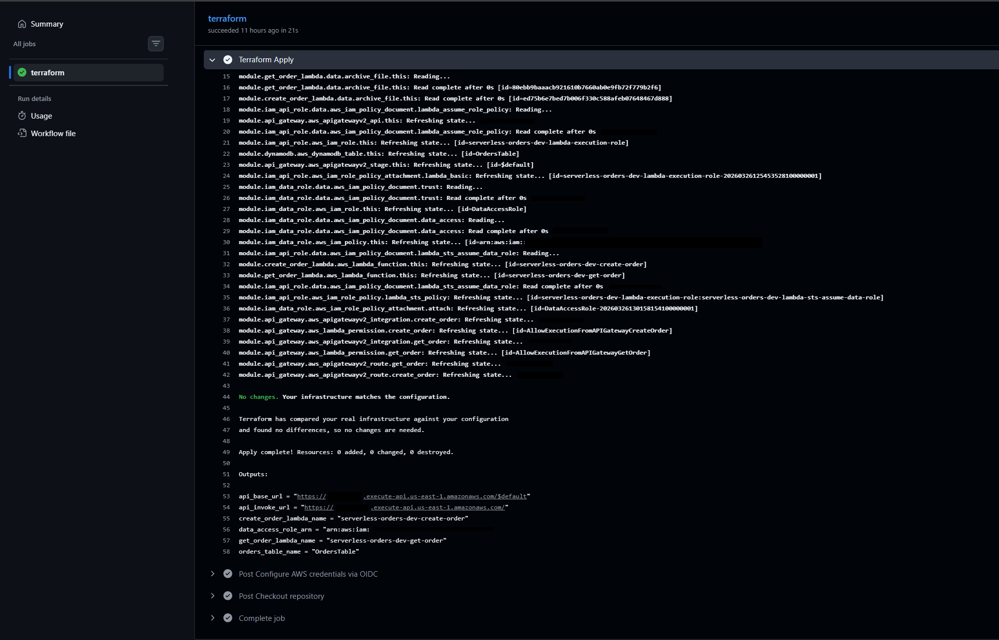
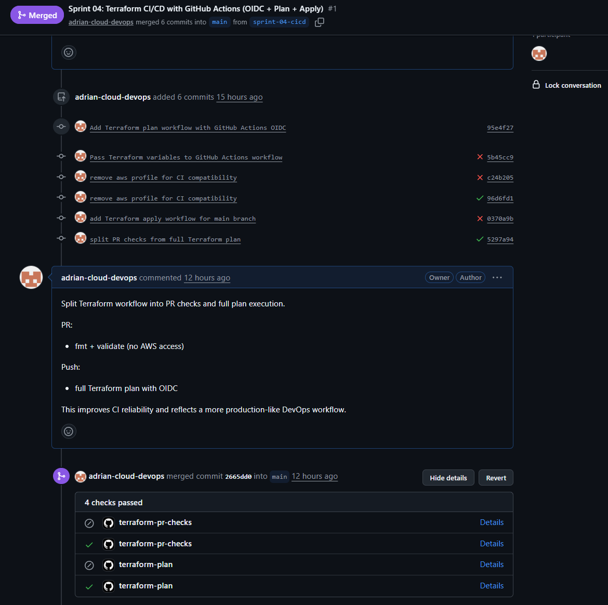

[← Previous: Sprint-03 Remote State](sprint-03-remote-state.md)
[Back to README](../../README.md)
[Next: Sprint-05 Monitoring →](sprint-05-monitoring.md)

# Sprint 04 — CI/CD Pipeline with GitHub Actions and OIDC

## Overview

The goal of Sprint 04 was to replace manual Terraform deployments from a local
machine with a fully automated CI/CD pipeline using GitHub Actions.

The pipeline is built around a clear separation of responsibilities across
three stages — each with a different level of AWS access and a different
purpose in the development lifecycle:

| Trigger | Stage | AWS access |
|---|---|---|
| Pull Request | Validation | None |
| Push to feature branch | Plan | OIDC |
| Merge to main | Apply | OIDC |

This design ensures that infrastructure changes are validated before they
reach AWS, previewed before they are applied, and deployed automatically
without any manual steps or stored credentials.

---

## Objectives

- automate Terraform validation, planning, and deployment via GitHub Actions
- implement OIDC authentication to eliminate static AWS credentials
- enforce a pull request review gate before infrastructure changes are applied
- document real pipeline failures and how they were resolved

---

## OIDC Authentication

The pipeline uses OpenID Connect (OIDC) to authenticate GitHub Actions with AWS.

Instead of storing long-lived access keys in GitHub Secrets, GitHub Actions
requests a short-lived token directly from AWS at runtime. AWS validates the
token against the configured Identity Provider and issues temporary credentials.
```
GitHub Actions job starts
        │
        │ requests OIDC token
        ▼
GitHub OIDC Provider
        │
        │ token issued
        ▼
AWS IAM (validates token against trust policy)
        │
        │ AssumeRoleWithWebIdentity
        ▼
GitHubActionsRole (Account C)
        │
        │ AssumeRole → TerraformDeployRole
        ▼
Account A / Account B
```

Benefits over static credentials:

- no access keys stored anywhere — nothing to rotate or leak
- credentials are automatically scoped to the duration of the job
- access is restricted at the IAM level to specific repositories and branches

---

## IAM Trust Policy

Access is restricted to specific branches using a condition on the OIDC subject claim.
Only workflows running on the listed branches can assume the role:
```json
{
  "Condition": {
    "StringLike": {
      "token.actions.githubusercontent.com:sub": [
        "repo:adrian-cloud-devops/serverless-orders-devops-multi-account:ref:refs/heads/sprint-04-cicd",
        "repo:adrian-cloud-devops/serverless-orders-devops-multi-account:ref:refs/heads/main"
      ]
    }
  }
}
```

A workflow running on any other branch cannot assume the role — even if
the repository and workflow file are identical.

---

## Pipeline Architecture

### Stage 1 — Validation (Pull Request)

Triggered on every pull request. No AWS access required.
```yaml
on:
  pull_request:
```

Steps:
- `terraform fmt -check` — enforces consistent formatting
- `terraform init -backend=false` — initializes without connecting to S3 backend
- `terraform validate` — checks configuration syntax and structure

This stage gives fast feedback to the developer without any AWS dependency.
It runs on every PR regardless of which branch it targets.

---

### Stage 2 — Plan (Feature Branch Push)

Triggered on push to the feature branch. Requires OIDC authentication.
```yaml
on:
  push:
    branches:
      - sprint-04-cicd
```

Steps:
- OIDC authentication via `aws-actions/configure-aws-credentials@v4`
- `terraform init` — initializes with real S3 backend
- `terraform validate`
- `terraform plan` — previews infrastructure changes against real AWS state

This stage surfaces any real infrastructure differences before the PR is merged.

---

### Stage 3 — Apply (Merge to Main)

Triggered on merge to main. Requires OIDC authentication.
```yaml
on:
  push:
    branches:
      - main
```

Steps:
- OIDC authentication
- `terraform init`
- `terraform apply -auto-approve`

This stage deploys infrastructure automatically after a PR is merged.
No manual intervention is required.

---

## Environment Variables

Terraform variables are injected using GitHub Actions variables via the
`TF_VAR_*` convention — Terraform automatically reads any environment
variable prefixed with `TF_VAR_` as an input variable.
```yaml
env:
  TF_VAR_account_a_api_id: ${{ vars.TF_VAR_account_a_api_id }}
  TF_VAR_account_b_data_id: ${{ vars.TF_VAR_account_b_data_id }}
  TF_VAR_aws_region: ${{ vars.TF_VAR_aws_region }}
```

Account IDs and region are stored as GitHub Actions Variables (not Secrets)
since they are not sensitive values. The role ARN used for OIDC is stored
as a Variable and referenced as:
```yaml
role-to-assume: ${{ vars.AWS_ROLE_TO_ASSUME }}
```

---

## Developer Workflow
```
1. Create feature branch
        │
        ▼
2. Push to feature branch
        │
        └── Plan workflow runs → preview infrastructure changes
        │
        ▼
3. Open Pull Request
        │
        └── Validation workflow runs → fmt + validate
        │
        ▼
4. PR reviewed and merged to main
        │
        └── Apply workflow runs → infrastructure deployed
```

---

## Challenges and Solutions

This sprint involved more pipeline debugging than infrastructure work.
Each failure below is a real issue encountered during implementation.

---

### Apply workflow not triggering after merge

The Terraform Apply workflow did not run after merging a PR to main.

**Root cause:** the workflow used a `paths` filter:
```yaml
paths:
  - 'terraform/**'
```

The merge commit did not include changes within that path, so the trigger
was silently skipped.

**Fix:** removed the `paths` filter from the apply workflow entirely:
```yaml
on:
  push:
    branches:
      - main
```

**Lesson:** path filters can silently block critical deployment workflows.
For apply stages, trigger on branch push without path restrictions.

---

### Workflow not appearing in GitHub Actions UI

The apply workflow was not visible in the Actions tab at all.

**Root cause:** the workflow file was named `terraform-apply-yml` — missing
the `.` before the extension.

**Fix:** renamed to `terraform-apply.yml`.

**Lesson:** GitHub only recognizes workflow files with `.yml` or `.yaml`
extensions inside `.github/workflows/`. A missing dot produces no error —
the file is simply ignored.

---

### OIDC authentication failing on main branch

The pipeline failed during AWS authentication when running on `main`.

**Root cause:** the IAM trust policy only allowed the feature branch:
```
refs/heads/sprint-04-cicd
```

When the workflow ran on `main`, the OIDC token was rejected because the
subject claim did not match any allowed value.

**Fix:** updated the trust policy to include both branches:
```json
"token.actions.githubusercontent.com:sub": [
  "repo:.../ref:refs/heads/sprint-04-cicd",
  "repo:.../ref:refs/heads/main"
]
```

**Lesson:** OIDC trust policies are evaluated at runtime against the exact
branch the workflow runs on. Every branch that needs AWS access must be
explicitly listed.

---

### Push to main rejected after PR merge

Local push to `main` was rejected with `failed to push some refs`.

**Root cause:** the local `main` branch was behind the remote after the PR
was merged via GitHub UI.

**Fix:**
```bash
git pull origin main
git push origin main
```

**Lesson:** always sync local branches after merging PRs through the GitHub UI.

---

### Terraform variables not available in pipeline

Terraform plan failed because input variables were undefined.

**Root cause:** variables from `.tfvars` are not automatically available in
GitHub Actions — the file is not present in the pipeline environment.

**Fix:** mapped each variable explicitly using the `TF_VAR_*` convention
in the workflow `env` block.

**Lesson:** CI/CD pipelines have no access to local files. All inputs must
be provided through environment variables or GitHub Secrets/Variables.

---

### AWS profile conflict between local and CI

Terraform worked locally but failed in CI because the `tools-local` AWS
profile does not exist in the GitHub Actions environment.

**Root cause:** the Terraform provider configuration referenced
`profile = "tools-local"` which is only available locally.

**Fix:** removed the profile reference from provider configuration and
switched fully to OIDC-based authentication for all pipeline runs.

**Lesson:** provider configuration must be environment-agnostic.
Local profiles should not be hardcoded — use OIDC in CI and let
`aws-actions/configure-aws-credentials` handle authentication.

---

### Workflow runs hidden by GitHub UI branch filter

No workflow runs were visible in the Actions tab despite successful pushes.

**Root cause:** a branch filter was active in the GitHub Actions UI, scoped
to `sprint-04-cicd`, hiding all runs on other branches.

**Fix:** removed the UI filter or switched it to `main`.

**Lesson:** always verify GitHub UI filters before starting to debug
missing workflow runs.

---

## Validation

After completing the pipeline setup, the full developer workflow was tested
end-to-end:

- push to feature branch triggered Plan — output visible in GitHub Actions UI
- pull request triggered Validation — `fmt`, `init`, `validate` passed
- merge to main triggered Apply — infrastructure deployed successfully
- API endpoints responded correctly after deployment

---
## Pipeline Evidence

### Workflows overview



All three workflows visible in the GitHub Actions UI — Validation triggered
by pull request, Plan triggered by feature branch push, and Apply triggered
by merge to main.

---

### OIDC misconfiguration failure



Pipeline failure caused by an incomplete IAM trust policy — the workflow
running on `main` was rejected because only `sprint-04-cicd` was listed
as an allowed branch in the OIDC condition. This was one of the more
difficult failures to diagnose because the error message from AWS does
not indicate which condition failed.

---

### Successful apply



Terraform Apply workflow completing successfully after merge to main —
OIDC authentication, remote state initialization, and infrastructure
deployment all passing in sequence.

---

### Pull request validation



Pull request check passing — `terraform fmt`, `terraform init -backend=false`,
and `terraform validate` all green. No AWS access required at this stage.

## Key Takeaways

- OIDC eliminates the need for long-lived AWS credentials in CI/CD — it is
  the correct default for any GitHub Actions workflow that needs AWS access
- The OIDC trust policy is evaluated at runtime against the exact branch
  context — every branch requiring AWS access must be explicitly listed
- Separating validation, plan, and apply into distinct stages reflects how
  production pipelines work — each stage has a clear purpose and a different
  risk level
- Small configuration details break pipelines silently — a missing file
  extension, an active UI filter, or a path restriction can all prevent
  a workflow from running with no visible error
- CI environments have no access to local files or profiles — all inputs
  must be injected through environment variables or secrets
- Debugging pipelines is a core DevOps skill — the ability to read workflow
  logs, isolate failures, and understand trigger conditions is as important
  as writing the workflow itself
- Removing `profile` from provider configuration in favor of OIDC makes
  the codebase portable — it works identically in local and CI environments
  when credentials are provided through environment variables

---

## Limitations at This Stage

- no manual approval gate before `terraform apply` — apply runs automatically
  on every merge to main
- no plan output saved as artifact — plan from feature branch is not reused
  during apply
- no drift detection between deployments
- no notifications on pipeline failure or successful deployment

---

## Future Improvements

- Manual approval step before apply using GitHub Environments
- Save and reuse `terraform plan` output as a pipeline artifact
- Drift detection scheduled workflow
- Multi-environment support (dev / staging / prod)
- Slack or email notifications on deployment events

[⬆ Back to top](#sprint-04--cicd-pipeline-with-github-actions-and-oidc)

---
[← Previous: Sprint-03 Remote State](sprint-03-remote-state.md)
[Back to README](../../README.md)
[Next: Sprint-05 Monitoring →](sprint-05-monitoring.md)