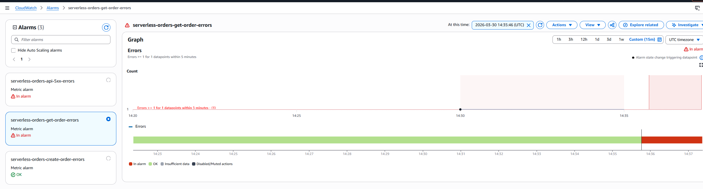
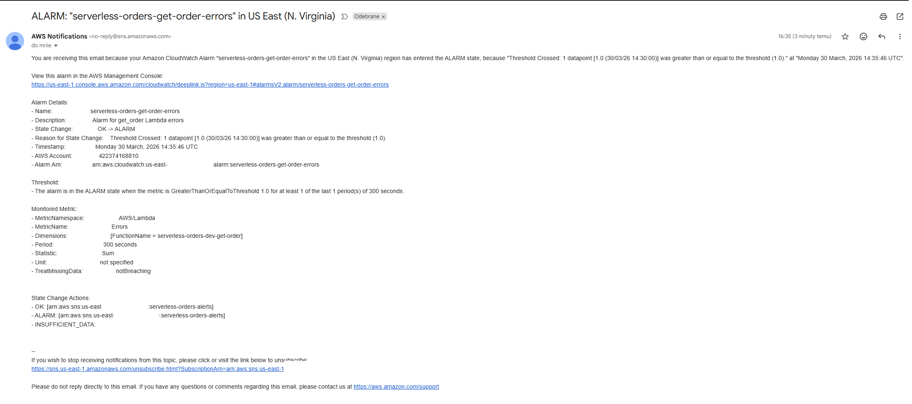

[← Previous: Sprint-04 CI/CD](sprint-04-ci-cd-github-actions-oidc.md)  
[Back to README](../../README.md)

# Sprint 05 — Observability and Alerting

## Overview

The goal of Sprint 05 was to introduce observability into the system using
AWS-native monitoring tools.

A working API with no visibility into its runtime behavior is not production-ready.
This sprint addresses that gap by implementing centralized logging, error detection,
and automated alerting — so that any failure in the system is visible and actionable
without manually checking logs.

---

## Objectives

- Define and manage CloudWatch Log Groups explicitly via Terraform
- Configure log retention to control storage costs
- Create CloudWatch Alarms based on Lambda error metrics
- Route alerts to an SNS topic with email delivery
- Validate the full alerting chain through controlled failure injection

---

## Infrastructure Components

| Resource | Account | Description |
|---|---|---|
| CloudWatch Log Group × 2 | A — Application | Dedicated log groups per Lambda function |
| CloudWatch Alarm × 2 | A — Application | Error threshold alarm per Lambda function |
| SNS Topic | A — Application | Alert delivery channel |
| SNS Subscription | A — Application | Email endpoint for alarm notifications |

---

## CloudWatch Log Groups

Dedicated log groups were explicitly defined in Terraform for each Lambda function:

- `/aws/lambda/serverless-orders-dev-create-order`
- `/aws/lambda/serverless-orders-dev-get-order`

Defining log groups explicitly rather than letting Lambda create them
implicitly matters for two reasons — retention policy and Terraform ownership.

Without explicit definition, Lambda auto-creates log groups with no retention
limit, meaning logs accumulate indefinitely. With Terraform managing them,
retention is enforced from the moment the function is deployed:
```
retention_in_days = 7
```

Seven days covers the window needed for debugging recent incidents while
preventing unbounded storage cost growth.

---

## CloudWatch Alarms

An alarm was created for each Lambda function monitoring the `Errors` metric
from the `AWS/Lambda` namespace.

| Setting | Value |
|---|---|
| Metric | `AWS/Lambda → Errors` |
| Threshold | `>= 1` |
| Period | 60 seconds |
| Evaluation periods | 1 |

This configuration means any unhandled Lambda exception within a 60-second
window transitions the alarm to `ALARM` state and triggers a notification.

The distinction between Lambda `Errors` and HTTP error responses is important
and is covered in the Challenges section below.

---

## SNS Topic and Email Alerting

An SNS topic was created to decouple the alarm from the notification mechanism.
CloudWatch alarms publish to the topic, and the topic routes to subscribers.
```
CloudWatch Alarm (ALARM state)
        │
        │ alarm_actions = [aws_sns_topic.alerts.arn]
        ▼
SNS Topic
        │
        ▼
Email Subscription (confirmed manually)
```

Routing through SNS rather than directly to email means the notification
channel can be extended later without changing the alarm configuration —
Slack, PagerDuty, or Lambda can be added as additional subscribers.

---

## End-to-End Alert Flow
```
API Request
        │
        ▼
Lambda Execution
        │
        │ unhandled exception
        ▼
CloudWatch Metrics (Errors count +1)
        │
        │ threshold breached
        ▼
CloudWatch Alarm → ALARM state
        │
        ▼
SNS Topic
        │
        ▼
Email Notification
```

---

## Validation

### Test strategy

Rather than relying on accidental failures, a controlled failure path was
introduced in the `get_order` Lambda outside the normal `try/except` block:
```python
if order_id == "trigger-alarm":
    raise Exception("test alarm triggered for get_order")
```

Placing the exception outside the error handling block ensures it propagates
as an unhandled exception — which is what CloudWatch counts as a Lambda `Error`.
Normal error handling paths (returning HTTP 400 or 500 responses) do not
increment the `Errors` metric.

### Test execution
```bash
curl "https:///orders/trigger-alarm"
```

### Observed results

- Lambda execution failed with an unhandled exception
- CloudWatch `Errors` metric incremented
- Alarm transitioned from `OK` → `ALARM` state
- SNS delivered email notification within approximately 60 seconds

---

## Validation Evidence

### CloudWatch Alarm in ALARM state



Alarm state after the controlled failure — correct metric, threshold breached,
alarm actions firing.

### SNS Email Notification



Email delivered by SNS confirming end-to-end alert chain is operational.

---

## Challenges and Solutions

### Lambda Errors metric not incrementing on HTTP 500 responses

The first approach to testing alarms was to send requests that caused the
Lambda to return HTTP 500 error responses. The alarm never triggered.

**Root cause:** the CloudWatch `Errors` metric counts unhandled exceptions
that cause Lambda invocation to fail — not HTTP responses returned by the
function. A Lambda that catches an exception and returns a structured
`{"statusCode": 500}` response is considered a successful invocation
from CloudWatch's perspective.

This is a meaningful distinction in production — it means `Errors` reflects
infrastructure-level failures (crashes, timeouts, out-of-memory) rather than
application-level errors (validation failures, not found, bad input).

**Fix:** moved the test exception outside the `try/except` block so it
propagates as a genuine unhandled exception rather than a handled response.

---

### Terraform ownership conflict on existing log groups

Terraform failed during `apply` with `ResourceAlreadyExistsException` on
the CloudWatch Log Group resources.

**Root cause:** Lambda had already auto-created the log groups on first
invocation in Sprint 01. When Terraform tried to create the same log groups
explicitly, AWS rejected the operation because they already existed.

**Fix:** deleted the auto-created log groups manually, then ran
`terraform apply` to recreate them under Terraform management with the
correct retention policy.

The underlying issue is that Lambda's implicit log group creation bypasses
Terraform entirely — this is why defining log groups explicitly in Terraform
from the start (Sprint 01 or 02) would have prevented the conflict.

---

### SNS email subscription requires manual confirmation

After Terraform created the SNS subscription, no notifications arrived
during initial testing.

**Root cause:** AWS requires explicit confirmation of email subscriptions
before they become active. The subscription sits in `PendingConfirmation`
state until the recipient clicks the confirmation link in the welcome email.

This is expected AWS behavior but easy to overlook — Terraform reports the
subscription as created successfully regardless of confirmation status.

**Fix:** confirmed the subscription via the email link before running
validation tests.

**Note for future:** this is one case where full automation is not possible
— email confirmation is a manual step by design. SMS or Lambda subscribers
do not require confirmation and can be fully automated.

---

### Alarm evaluation period vs metric publication delay

The alarm did not transition to `ALARM` state immediately after the
Lambda error occurred.

**Root cause:** CloudWatch metrics are not real-time — there is typically
a 1–3 minute delay between a Lambda invocation and the metric appearing
in CloudWatch. With a 60-second evaluation period, the alarm evaluates
the metric once per minute and transitions only after the metric value
is actually published.

**Fix:** waited 2–3 minutes after the test invocation before concluding
the alarm was not working. The notification arrived within the expected window.

**Lesson:** when debugging CloudWatch alarms, always account for metric
publication delay before assuming a configuration problem.

---

## Key Takeaways

- Explicit Terraform management of log groups is strictly better than relying
  on Lambda auto-creation — retention policy, cost control, and Terraform
  ownership all depend on it
- The CloudWatch `Errors` metric counts invocation failures, not HTTP error
  responses — understanding this distinction is essential for designing
  meaningful alarms
- Routing alarms through SNS rather than directly to email decouples the
  detection mechanism from the notification channel — adding Slack or
  PagerDuty later requires no changes to the alarm configuration
- CloudWatch metrics have a publication delay — real-time debugging requires
  CloudWatch Logs Insights, not metric-based alarms
- Controlled failure injection is the correct way to validate monitoring
  systems — waiting for accidental failures in test environments is not
  a reliable strategy
- Observability is not a feature you add at the end — the conflict with
  auto-created log groups showed that observability decisions made late
  create cleanup work that could have been avoided from Sprint 01

---

## Limitations at This Stage

- No log-based metrics — errors detectable only via Lambda `Errors` metric,
  not by log content pattern matching
- No structured logging — Lambda outputs plain text, making log parsing
  and filtering more difficult
- No distributed tracing — individual Lambda invocations are not traceable
  across the request lifecycle
- No CloudWatch Dashboard — metrics and alarms exist but have no unified view
- Alerting is email-only — no integration with Slack, PagerDuty, or similar

---

## Future Improvements

- Structured JSON logging for consistent log parsing and filtering
- Log-based metric filters to detect ERROR patterns in log content
- CloudWatch Dashboard for unified visibility across both Lambda functions
- AWS X-Ray for distributed tracing across API Gateway and Lambda
- Slack integration via SNS → Lambda → Slack webhook

[⬆ Back to top](#sprint-05--observability-and-alerting)

---
[← Previous: Sprint-04 CI/CD](sprint-04-ci-cd-github-actions-oidc.md)  
[Back to README](../../README.md)